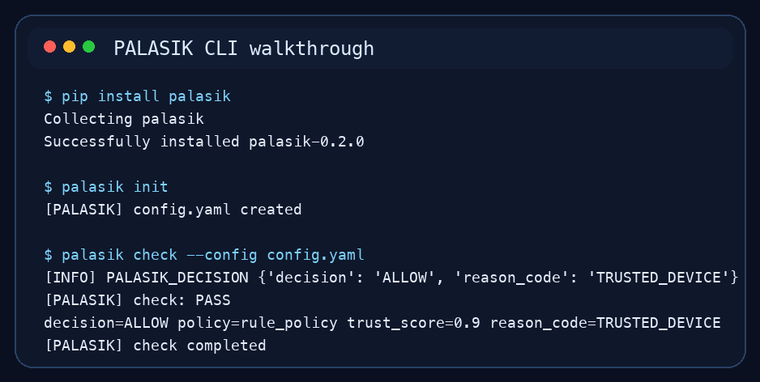
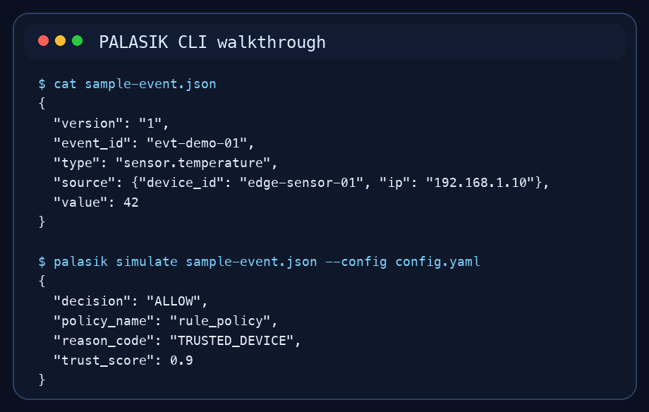
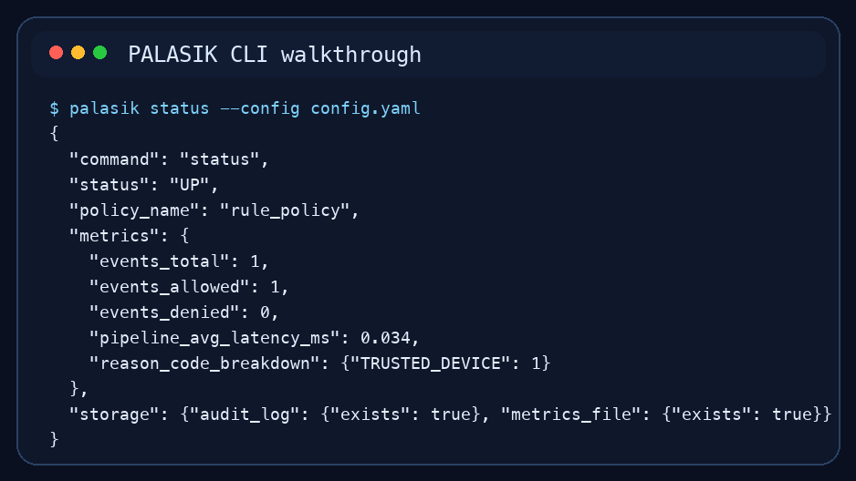
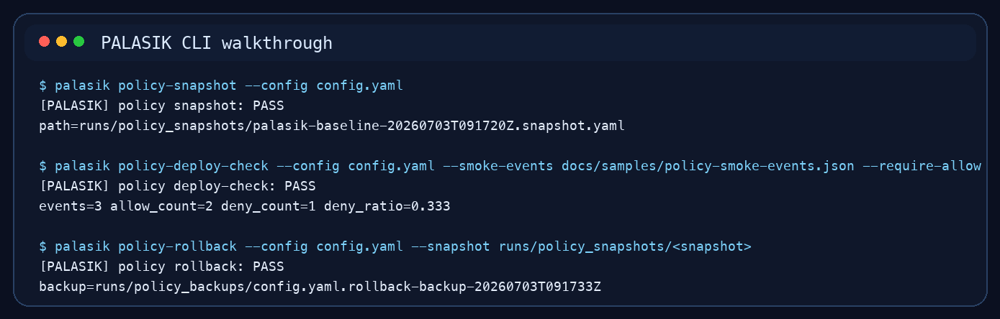

# DEMIT + PALASIK

**DEMIT Super App for Digital Monitoring, with PALASIK as the Zero Trust IoT security application**

[](https://pypi.org/project/palasik/)
[](https://pypi.org/project/palasik/)
[](https://github.com/notedavidrinaldi/palasik-iot-framework/actions/workflows/ci-staging.yml)
[](LICENSE.md)
[]()

PALASIK adalah framework Python untuk **Zero Trust IoT event enforcement** di **edge/gateway**. Repo ini cocok untuk orang yang ingin:

- mencoba pipeline keputusan `trust -> policy -> action` dalam hitungan menit
- membangun gateway IoT yang lebih aman di Raspberry Pi, MQTT, atau HTTP event flow
- berkontribusi pada framework riset yang terbuka untuk docs, test, plugin, dan eksperimen

## Start Here

- Quickstart: [docs/GETTING_STARTED.md](docs/GETTING_STARTED.md)
- Arsitektur: [docs/ARCHITECTURE.md](docs/ARCHITECTURE.md)
- Runbook operasional: [docs/OPERATIONAL_RUNBOOK.md](docs/OPERATIONAL_RUNBOOK.md)
- Deploy edge: [docs/EDGE_DEPLOYMENT.md](docs/EDGE_DEPLOYMENT.md)
- Integrasi DEMIT: [docs/DEMIT.md](docs/DEMIT.md)
- Cara kontribusi: [CONTRIBUTING.md](CONTRIBUTING.md)
- Good first issues: [docs/GOOD_FIRST_ISSUES.md](docs/GOOD_FIRST_ISSUES.md)
- Diskusi komunitas: <https://github.com/notedavidrinaldi/palasik-iot-framework/discussions>

## Kenapa Layak Di-fork?

- **Research-ready**: cocok untuk eksperimen trust scoring, policy engine, dan IoT security workflow.
- **Practical ops**: sudah punya health contract, deploy gate, rollback, dan post-restart check.
- **Contribution-friendly**: kontribusi docs, sample config, plugin, test, dan use case sama berharganya dengan perubahan core.

## Quick Demo

```bash
pip install palasik
palasik init
palasik check --config config.yaml
palasik simulate docs/samples/event-valid.json --config config.yaml
palasik status --config config.yaml
```

## PALASIK Bukan Mikrokontroler

PALASIK **bukan** mikrokontroler. PALASIK adalah **software/framework Python** untuk keamanan IoT berbasis Zero Trust yang berjalan di **edge device, gateway, atau server kecil**.

Perbedaannya singkat:

- `PALASIK`: software untuk evaluasi trust, policy, dan enforcement event IoT
- `mikrokontroler`: hardware seperti ESP32, STM32, atau Arduino
- `Raspberry Pi`: single-board computer yang bisa menjadi host untuk menjalankan PALASIK

Jadi, PALASIK bisa dipakai **bersama** perangkat berbasis mikrokontroler, tetapi PALASIK sendiri bukan jenis mikrokontroler.

Versi sangat singkat:

> PALASIK adalah software keamanan IoT, bukan mikrokontroler.

Versi formal:

> PALASIK adalah framework perangkat lunak berbasis Python yang dirancang untuk menjalankan fungsi evaluasi trust, policy enforcement, dan pengamanan alur event IoT pada lapisan edge atau gateway. Dengan demikian, PALASIK tidak termasuk kategori mikrokontroler, melainkan komponen software yang dapat dioperasikan pada perangkat komputasi seperti Raspberry Pi, mini PC, atau server ringan, serta terintegrasi dengan node IoT yang menggunakan mikrokontroler seperti ESP32, STM32, atau Arduino.

Versi akademik:

> Secara konseptual, PALASIK diklasifikasikan sebagai framework perangkat lunak untuk keamanan sistem IoT pada lapisan edge computing, bukan sebagai perangkat keras mikrokontroler. Peran PALASIK adalah melakukan evaluasi trust, penerapan policy, dan enforcement terhadap event atau komunikasi IoT, sedangkan mikrokontroler seperti ESP32, STM32, dan Arduino berperan sebagai node/perangkat lapangan yang menghasilkan atau menerima data.

Versi presentasi satu kalimat:

> PALASIK bukan mikrokontroler, melainkan framework software keamanan IoT yang berjalan di edge/gateway dan dapat terhubung dengan perangkat berbasis ESP32, STM32, Arduino, atau sensor lain.

## Panduan Install dan Penggunaan

Bagian ini ditulis untuk orang yang ingin menjalankan PALASIK dari nol, memeriksa kondisinya, lalu menyiapkan rollout policy dengan aman.

### 1. Kebutuhan Sistem

- Python `3.10+`
- `pip`
- terminal Linux, macOS, atau WSL
- opsional: virtual environment agar environment tetap bersih

### 2. Instalasi

Cara paling cepat dari PyPI:

```bash
python3 -m venv .venv
source .venv/bin/activate
pip install --upgrade pip
pip install palasik
```

Kalau Anda sedang mengembangkan dari source repo ini:

```bash
python3 -m venv .venv
source .venv/bin/activate
pip install --upgrade pip
pip install -e '.[dev]'
```

Setelah terpasang, cek command yang tersedia:

```bash
palasik --help
demit --help
```

### 3. Inisialisasi Proyek Kerja

Buat folder kerja baru lalu generate baseline config:

```bash
mkdir palasik-demo
cd palasik-demo
palasik init
```

Ini akan membuat `config.yaml` baseline yang bisa langsung dipakai untuk percobaan awal.



### 4. Jalankan Startup Health Check

Sebelum memproses event sungguhan, validasi dulu bahwa trust engine, policy engine, dan plugin dasar bisa dimuat dengan benar:

```bash
palasik check --config config.yaml
```

Jika hasilnya `PASS`, berarti pipeline dasar PALASIK sudah siap dipakai.

Yang divalidasi di langkah ini:

- file konfigurasi bisa dibaca
- policy baseline valid
- trust dan policy pipeline dapat berjalan
- plugin/action dasar dapat dipanggil

### 5. Simulasikan Event

Untuk percobaan cepat dari repo ini, Anda bisa memakai sample bawaan:

```bash
palasik simulate docs/samples/event-valid.json --config config.yaml
```

Kalau Anda bekerja di folder lain, salin sample event ke folder kerja Anda:

```bash
cp /path/ke/palasik-iot-framework/docs/samples/event-valid.json sample-event.json
palasik simulate sample-event.json --config config.yaml
```



Hal yang perlu diperhatikan pada output:

- `decision`: hasil akhir seperti `ALLOW`, `DENY`, atau `RESTRICT`
- `policy_name`: policy yang sedang aktif
- `reason_code`: alasan keputusan agar mudah diaudit
- `trust_score`: skor kepercayaan event

### 6. Cek Status dan Metrik Runtime

Untuk melihat kondisi gateway secara cepat:

```bash
palasik status --config config.yaml
```



Biasanya operator melihat 5 indikator ini terlebih dahulu:

- `status`: `UP`, `DEGRADED`, atau `DOWN`
- `events_total`: jumlah event yang sudah diproses
- `events_allowed` dan `events_denied`: komposisi keputusan
- `pipeline_avg_latency_ms`: latensi rata-rata pipeline
- `reason_code_breakdown`: distribusi alasan keputusan

### 7. Jalankan Agent PALASIK

Jika config sudah lolos dan simulasi terlihat benar, jalankan agent:

```bash
palasik run --config config.yaml
```

Mode ini cocok saat Anda ingin PALASIK menerima event dari adapter yang aktif pada konfigurasi.

### 8. Jalankan Sebagai HTTP API

Jika Anda ingin mengekspos PALASIK sebagai service HTTP:

```bash
palasik serve-api --config config.yaml
```

Ini berguna untuk integrasi ringan, pengujian lokal, atau gateway yang ingin dihubungkan ke service lain.

### 9. Operasional Aman Sebelum Deploy Perubahan Policy

Sebelum rollout policy baru:

```bash
palasik policy-snapshot --config config.yaml
palasik policy-deploy-check --config config.yaml --require-allow
```

Jika hasil `policy-deploy-check` jelek atau health turun, rollback cepat:

```bash
palasik policy-rollback --config config.yaml --snapshot runs/policy_snapshots/<snapshot>
```



Catatan penting:

- `policy-snapshot` membuat snapshot policy aktif agar rollback bisa cepat.
- `policy-deploy-check` memerlukan smoke events. Jika Anda menjalankannya dari folder kerja baru, siapkan file smoke event sendiri atau beri path eksplisit lewat `--smoke-events`.
- contoh yang aman saat dijalankan dari root repo:

```bash
palasik policy-deploy-check \
  --config config.yaml \
  --smoke-events docs/samples/policy-smoke-events.json \
  --require-allow
```

Shortcut operasional yang paling sering dipakai:

```bash
make edge-health
make edge-health-wait
make edge-health-strict
make edge-post-restart-check
make edge-post-restart-check-strict
```

Ringkasannya:

- `edge-health`: cek health cepat
- `edge-health-wait`: cek health dengan retry lebih panjang
- `edge-health-strict`: hanya lolos jika status `UP`
- `edge-post-restart-check`: `check-startup` lalu tunggu health
- `edge-post-restart-check-strict`: versi gate ketat pasca-restart

### 10. Setelah Berhasil Jalan, Baca Ini

- Quickstart lebih ringkas: [docs/GETTING_STARTED.md](docs/GETTING_STARTED.md)
- Konfigurasi detail: [docs/CONFIG.md](docs/CONFIG.md)
- Runbook operasional: [docs/OPERATIONAL_RUNBOOK.md](docs/OPERATIONAL_RUNBOOK.md)
- Deploy edge: [docs/EDGE_DEPLOYMENT.md](docs/EDGE_DEPLOYMENT.md)
- Integrasi DEMIT: [docs/DEMIT.md](docs/DEMIT.md)

## DEMIT Super App

DEMIT adalah kerangka **super app** yang dirancang untuk menampung beberapa aplikasi digital dalam satu runtime terpadu.

Di dalam roadmap DEMIT:

- **PALASIK** menjadi **App 1**
- fokus PALASIK adalah **keamanan IoT berbasis Zero Trust**
- aplikasi lain nantinya bisa ditambahkan tanpa merusak core PALASIK

Contoh `demit.yaml` bawaan:

```yaml
demit:
  apps:
    - palasik

apps:
  palasik:
    type: palasik
    config_file: "config.yaml"
    plugins_path: "plugins"
    routes:
      - palasik
```

Jalankan:

```bash
demit --config demit.yaml
```

## Jalur Aktif dan Migrasi

Untuk konsistensi implementasi saat ini, gunakan jalur aktif berikut:

- Trust: `palasik.trust`
- Policy: `palasik.policy`

Import dari `palasik.core.trust_engine` dan `palasik.core.policy_engine` tetap didukung untuk kompatibilitas, tetapi berada di jalur deprecation.

Untuk enforce perilaku migrasi secara lokal:

```bash
python3 scripts/check_legacy_imports.py
make migration-check
```

## Testing

```bash
python3 -m pytest -q
```

Strict deprecation gate:

```bash
PALASIK_STRICT_DEPRECATION=1 python3 -m pytest -q -W error::DeprecationWarning
```

## Dokumentasi Lanjutan

- [docs/ARCHITECTURE.md](docs/ARCHITECTURE.md)
- [docs/CONFIG.md](docs/CONFIG.md)
- [docs/POLICY_ENGINE.md](docs/POLICY_ENGINE.md)
- [docs/TRUST_ENGINE.md](docs/TRUST_ENGINE.md)
- [docs/OPERATIONAL_RUNBOOK.md](docs/OPERATIONAL_RUNBOOK.md)
- [docs/EDGE_DEPLOYMENT.md](docs/EDGE_DEPLOYMENT.md)
- [docs/MIGRATION_GATE.md](docs/MIGRATION_GATE.md)

## Contributing

Kontribusi sangat diterima, terutama untuk:

- trust model baru
- policy logic
- adapter tambahan
- benchmark dan dataset
- dokumentasi dan studi kasus

Mulai cepat:

- buat PR kecil lebih dulu
- ikuti alur di [CONTRIBUTING.md](CONTRIBUTING.md)
- lihat label `good first issue`

## Citation

Jika menggunakan PALASIK dalam publikasi ilmiah, silakan sertakan sitasi dari [docs/raw/citation.md](docs/raw/citation.md).

## License

MIT License.
