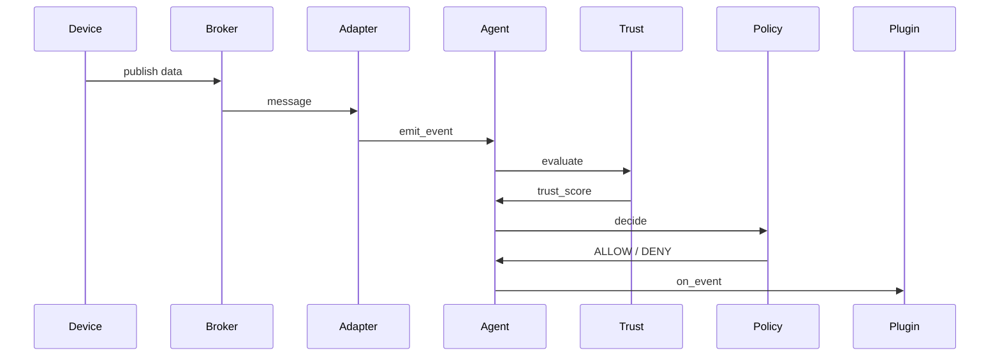

# PALASIK Architecture

Dokumen ini menjelaskan arsitektur PALASIK sebagai framework IoT Gateway
berbasis Zero Trust.

---

## Komponen Utama

1. **Agent**
   Runtime utama yang mengatur lifecycle sistem.

2. **Adapter**
   Jembatan antara dunia luar (MQTT, HTTP) dan event internal PALASIK.

3. **Trust Engine**
   Menghitung skor kepercayaan event.

4. **Policy Engine**
   Menentukan keputusan keamanan (ALLOW / DENY).

5. **Plugin**
   Menangani event berdasarkan keputusan policy.

---

## Alur Event

Prinsip Desain

-Zero Trust by Default

-Separation of Concern

-Extensible via Plugin

-Single Direction Data Flow

