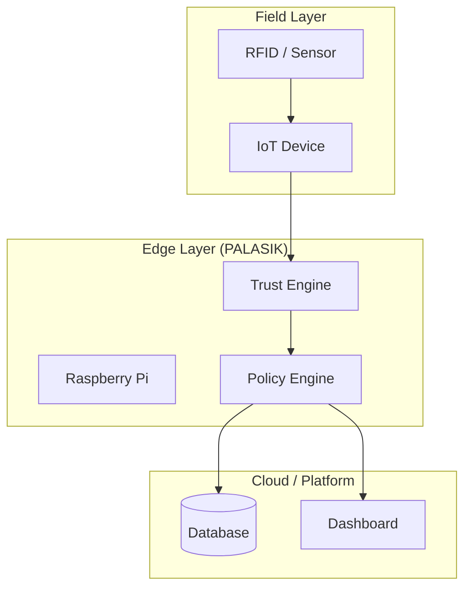

# Arsitektur Sistem PALASIK

## 1. Gambaran Umum
PALASIK menggunakan pendekatan **Edge-based Zero Trust Architecture**, di mana keputusan keamanan dilakukan sedekat mungkin dengan sumber data.

## 2. Layer Arsitektur

