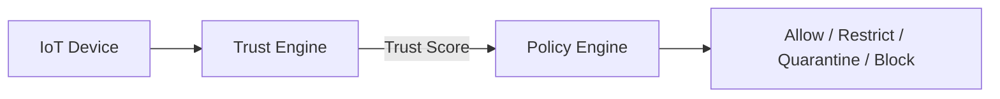
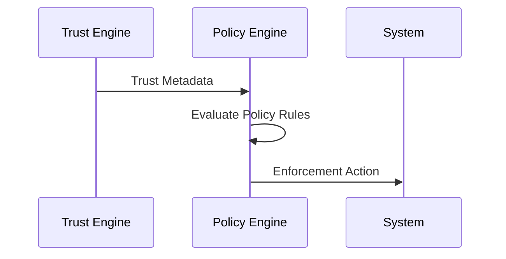

# Policy Engine

## 1. Pendahuluan

Policy Engine adalah komponen pengambil keputusan (*decision-making component*)
dalam arsitektur **PALASIK**, yang bertugas menerjemahkan hasil evaluasi dari
**Trust Engine** menjadi aksi nyata terhadap perangkat IoT.

Jika Trust Engine menjawab pertanyaan:

> *“Seberapa bisa perangkat ini dipercaya?”*

Maka Policy Engine menjawab:

> *“Apa yang boleh dan tidak boleh dilakukan perangkat ini?”*

---

## 2. Peran Policy Engine dalam Arsitektur PALASIK



# Policy Engine

## 1. Pendahuluan

Policy Engine adalah komponen pengambil keputusan (*decision-making component*)
dalam arsitektur 

##3. Prinsip Dasar Policy Engine

Policy Engine PALASIK dibangun berdasarkan prinsip:

1. Policy-as-Code

2. Least Privilege

3. Context-Aware Decision

4. Explainable Decision

5. Fail-Safe Default (Deny by Default)


## 4. Input Policy Engine

Policy Engine menerima input terstruktur dari Trust Engine:
```json
{
  "device_id": "sensor-001",
  "trust_score": 0.72,
  "trust_level": "LIMITED",
  "behavior_flags": ["HIGH_FREQ_CONN"],
  "timestamp": "2026-01-11T10:20:00Z"
}
```

## 5. Policy Decision Levels
Policy Engine mengklasifikasikan keputusan ke dalam empat level:

| Level      | Aksi           | Deskripsi                 |
| ---------- | -------------- | ------------------------- |
| ALLOW      | Full Access    | Perangkat dipercaya penuh |
| RESTRICT   | Limited Access | Akses dibatasi            |
| QUARANTINE | Isolated       | Perangkat diisolasi       |
| BLOCK      | Deny           | Akses sepenuhnya ditolak  |

##6. Policy Rule Model

Policy didefinisikan menggunakan format deklaratif (YAML / JSON).

###6.1 Contoh Policy YAML
```json
policies:
  - name: trusted_device_policy
    condition:
      trust_score: ">= 0.80"
    action: ALLOW

  - name: limited_device_policy
    condition:
      trust_score: ">= 0.50"
    action: RESTRICT

  - name: suspicious_device_policy
    condition:
      trust_score: "< 0.50"
    action: QUARANTINE

  - name: untrusted_device_policy
    condition:
      trust_score: "< 0.30"
    action: BLOCK
```

##7. Policy Evaluation Flow


##8. Policy Enforcement Mechanism

Policy Engine tidak hanya membuat keputusan, tetapi juga
menjalankan enforcement, seperti:

### 8.1 Network Enforcement

Firewall rules (iptables / nftables)

VLAN isolation

Port blocking

### 8.2 Application Enforcement

Node-RED flow disable

MQTT topic restriction

API access denial

### 8.3 Device Enforcement

Device blacklist

RFID access denial

Session termination

## 9. Contoh Enforcement di Edge (iptables)
# Block device IP
iptables -A INPUT -s 192.168.1.50 -j DROP

## 10. Integrasi dengan Node-RED

Policy Engine dapat diintegrasikan dengan Node-RED menggunakan:

Function Node (decision logic)

Exec Node (enforcement)

Dashboard Node (monitoring)

Contoh Payload Enforcement
```json
{
  "device_id": "sensor-001",
  "policy_action": "RESTRICT",
  "applied_rule": "limited_device_policy"
}
```

## 11. Logging & Audit Trail

Setiap keputusan Policy Engine dicatat untuk keperluan:

Audit keamanan

Analisis forensik

Publikasi ilmiah

Contoh log:
```json
{
  "device_id": "sensor-001",
  "trust_score": 0.72,
  "decision": "RESTRICT",
  "timestamp": "2026-01-11T10:22:10Z"
}
```

## 12. Keunggulan Akademik Policy Engine PALASIK

Explainable security decision

Reproducible experiment

Cocok untuk paper:

IoT Security

Edge Computing

Zero Trust Architecture

## 13. Arah Pengembangan

Rencana lanjutan Policy Engine:

Policy berbasis Machine Learning

Adaptive policy update

Federated policy antar edge

Integration with Trust Graph

## 14. Kesimpulan

Policy Engine PALASIK menyediakan sistem pengambilan keputusan keamanan IoT yang:

Transparan

Terukur

Dapat dikonfigurasi

Siap untuk riset dan implementasi nyata

Policy Engine menjadi jembatan antara analisis kepercayaan dan
aksi keamanan nyata.
