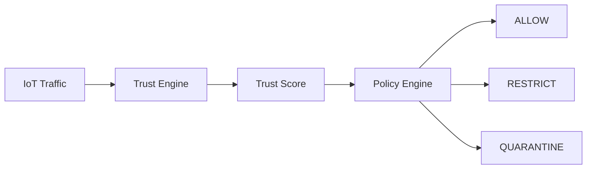

# Experimental Scenarios & Dataset
## PALASIK – Edge Trust & Policy Framework for IoT Security

---

## 1. Tujuan Eksperimen

Eksperimen ini bertujuan untuk:

1. Mengevaluasi efektivitas **Trust Engine** dalam menilai perangkat IoT
2. Mengukur akurasi **Policy Engine** dalam mengambil keputusan keamanan
3. Membandingkan performa **edge-based security** vs pendekatan statis
4. Menilai kelayakan Raspberry Pi 3B sebagai **IoT Security Gateway**

---

## 2. Lingkungan Eksperimen

### 2.1 Perangkat

| Komponen | Spesifikasi |
|--------|------------|
| Gateway | Raspberry Pi 3 Model B |
| OS | Raspberry Pi OS Lite 64-bit |
| Middleware | Node-RED |
| Trust Engine | Python |
| Policy Engine | YAML + Shell |
| Network | LAN isolated |

---

### 2.2 Perangkat IoT Simulasi

| Device ID | Tipe | Perilaku |
|---------|-----|---------|
| D01 | Sensor Suhu | Normal |
| D02 | RFID Reader | Normal |
| D03 | Camera IoT | High Traffic |
| D04 | Unknown Device | Suspicious |
| D05 | Compromised Node | Malicious |

---

## 3. Definisi Dataset

Dataset disusun untuk merepresentasikan **perilaku perangkat IoT** di edge network.

### 3.1 Struktur Dataset (JSON)

```json
{
  "device_id": "D04",
  "timestamp": "2026-01-10T14:32:10",
  "auth_status": "failed",
  "failed_auth_count": 5,
  "packet_rate": 320,
  "protocol": "TCP",
  "anomaly_flag": true,
  "trust_score": null
}
```

### 3.2 Parameter Dataset
Parameter	Deskripsi
device_id	ID unik perangkat
auth_status	Status autentikasi
failed_auth_count	Jumlah kegagalan
packet_rate	Paket per detik
protocol	Protokol komunikasi
anomaly_flag	Deteksi anomali
trust_score	Nilai kepercayaan

## 4. Trust Score Model
### 4.1 Formula Trust Score
```text
Trust Score = 1.0 
- (0.1 × failed_auth_count)
- (0.4 × anomaly_flag)
- (0.2 × high_packet_rate)
```
Nilai akhir:
```text
0.8 – 1.0 → Trusted

0.5 – 0.79 → Limited Trust

< 0.5 → Untrusted
```

## 5. Skenario Eksperimen
🧪 Skenario 1: Perangkat Normal
Tujuan:
Memvalidasi bahwa perangkat normal tidak terkena enforcement.

Parameter	Nilai
failed_auth	0
packet_rate	Normal
anomaly	false

Ekspektasi:
✔ Trust Score ≥ 0.8
✔ Policy: ALLOW

🧪 Skenario 2: Brute Force Authentication
Tujuan:
Menguji sensitivitas Trust Engine terhadap kegagalan login.

failed_auth	Trust Score	Policy
1	0.9	ALLOW
3	0.7	RESTRICT
5	0.4	QUARANTINE

🧪 Skenario 3: Anomaly Traffic Attack
Deskripsi:
Perangkat mengirim trafik abnormal (DoS ringan).

Parameter	Nilai
packet_rate	>300 pkt/s
anomaly	true

Ekspektasi:
❌ Trust Score < 0.5
❌ Enforcement aktif (iptables DROP)

🧪 Skenario 4: Rogue Device Injection
Deskripsi:
Perangkat tidak terdaftar mencoba bergabung.

Hasil yang diharapkan:

Trust Score = 0

Isolasi otomatis

Log keamanan tercatat

🧪 Skenario 5: Dynamic Trust Recovery
Tujuan:
Menguji apakah perangkat bisa memulihkan trust.

Waktu	Trust Score
T0	0.45
T+10m	0.60
T+30m	0.82

✔ Policy berubah otomatis dari QUARANTINE → ALLOW

## 6. Metode Evaluasi
### 6.1 Metrik Evaluasi
Metrik	         Deskripsi
Accuracy	Akurasi keputusan policy
False Positive	Salah isolasi
Response Time	Waktu enforcement
CPU Usage	Beban Raspberry Pi
Memory Usage	Konsumsi RAM

### 6.2 Pengambilan Data
Node-RED log

Python trust logs

iptables log

System metrics (htop, vmstat)

## 7. Visualisasi Eksperimen

## 8. Validitas & Reproduksibilitas
✔ Dataset bersifat synthetic + configurable
✔ Eksperimen dapat direplikasi di:

Raspberry Pi 3 / 4

Virtual Machine

Industrial Gateway

## 9. Potensi Publikasi
Eksperimen ini layak untuk:

Skripsi / Tesis

Jurnal nasional

Konferensi IEEE IoT / Edge Computing

## 10. Dataset Extension (Future Work)
Federated trust learning

Multi-gateway collaboration

Integration with blockchain trust ledger

AI-based anomaly detection

## 11. Kesimpulan Eksperimen
PALASIK membuktikan bahwa:

Edge-based Trust & Policy Engine mampu meningkatkan keamanan IoT secara adaptif, ringan, dan terukur
