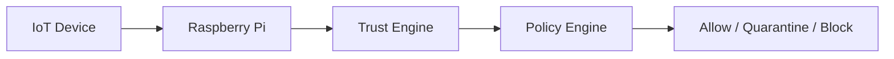

---
title: "Trust Engine"
weight: 3
---

# Trust Engine

## 1. Pendahuluan

Trust Engine merupakan komponen inti dalam proyek **PALASIK** yang bertugas
melakukan evaluasi tingkat kepercayaan (*trust score*) terhadap setiap entitas
IoT yang berinteraksi di edge node (Raspberry Pi).

Berbeda dengan sistem keamanan konvensional yang berbasis autentikasi statis,
Trust Engine PALASIK menerapkan prinsip **Zero Trust**:

> *Never trust, always verify.*

Setiap perangkat, sensor, atau service **tidak pernah dianggap aman secara default**,
meskipun berada di jaringan lokal.

---

## 2. Tujuan Trust Engine

Trust Engine dirancang untuk:

1. Mendeteksi perangkat IoT tidak sah (*rogue device*)
2. Menilai perilaku perangkat secara dinamis
3. Menyediakan dasar keputusan untuk Policy Engine
4. Mengurangi risiko lateral movement pada jaringan IoT
5. Mendukung riset keamanan edge computing berbasis Raspberry Pi

---

## 3. Posisi Trust Engine dalam Arsitektur PALASIK


Trust Engine berada di edge, bukan di cloud, sehingga:

Latensi rendah

Privasi data lebih terjaga

Tetap berjalan meskipun koneksi internet terputus

## 4. Parameter Evaluasi Trust
Trust Engine PALASIK menggunakan beberapa parameter utama:

### 4.1 Device Identity
MAC Address

Device ID

Vendor fingerprint

RFID / Hardware Tag (opsional)

### 4.2 Network Behavior
Frekuensi koneksi

Pola port yang digunakan

Protokol komunikasi

Volume data abnormal

### 4.3 Temporal Behavior
Waktu aktif perangkat

Konsistensi jam operasi

Pola anomali (misal aktif tengah malam)

###4.4 Historical Trust
Riwayat pelanggaran

Status sebelumnya

Trust decay (penurunan kepercayaan)

## 5. Model Trust Score
Trust Score dinyatakan dalam rentang:

0.0        ────────────────  1.0
Tidak dipercaya         Sangat dipercaya

Kategori Trust:
Trust Score	Status
0.80 – 1.00	Trusted
0.50 – 0.79	Limited
0.30 – 0.49	Suspicious
< 0.30	Untrusted

## 6. Formula Trust Score (Baseline)
Trust Score dihitung menggunakan model berbobot:

T = (w1 × I) + (w2 × B) + (w3 × H)
Dimana:

I = Identity Score

B = Behavior Score

H = Historical Score

w1 + w2 + w3 = 1

Contoh bobot awal:

w1 = 0.4

w2 = 0.4

w3 = 0.2

Bobot dapat dikonfigurasi sesuai kebutuhan riset.

## 7. Algoritma Trust Evaluation (Pseudocode)
INPUT: device_data
OUTPUT: trust_score

initialize trust_score = 1.0

if device_identity_invalid:
    trust_score -= 0.4

if abnormal_network_behavior:
    trust_score -= 0.3

if history_contains_violation:
    trust_score -= 0.2

apply trust_decay()

return clamp(trust_score, 0.0, 1.0)

## 8. Trust Decay Mechanism
Trust tidak bersifat permanen.
PALASIK menerapkan Trust Decay:

Trust berkurang seiring waktu

Perangkat harus terus membuktikan perilaku normal

Mengurangi risiko perangkat lama yang telah dikompromi

Contoh:

trust_score = trust_score × 0.98 setiap 24 jam

## 9. Output Trust Engine
Trust Engine menghasilkan metadata berikut:

```json
{
  "device_id": "sensor-001",
  "trust_score": 0.72,
  "trust_level": "LIMITED",
  "last_evaluated": "2026-01-11T10:15:00Z",
  "recommendation": "RESTRICT"
}
```

Output ini menjadi input utama bagi Policy Engine.

## 10. Kontribusi Akademik
Keunikan Trust Engine PALASIK:

Zero Trust di edge, bukan cloud

Cocok untuk perangkat low-power

Mudah direplikasi untuk penelitian

Relevan untuk:

Smart Factory

Smart Port

Smart Agriculture

Healthcare IoT

## 11. Arah Pengembangan
Rencana pengembangan Trust Engine:

Integrasi Machine Learning (Anomaly Detection)

Trust berbasis graph (device-to-device trust)

Federated Trust antar edge node

Integrasi TPM / Secure Element

## 12. Kesimpulan
Trust Engine PALASIK menyediakan pendekatan keamanan IoT yang:

Adaptif

Ringan

Akademis

Praktis untuk implementasi nyata

Komponen ini menjadi fondasi utama sistem keamanan IoT berbasis Raspberry Pi.

“In Zero Trust systems, trust is not granted.
It is continuously earned.”
